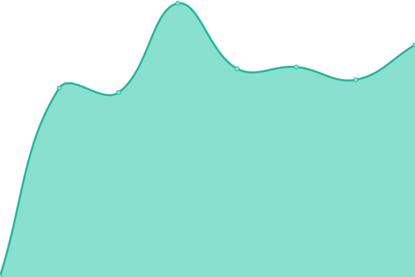
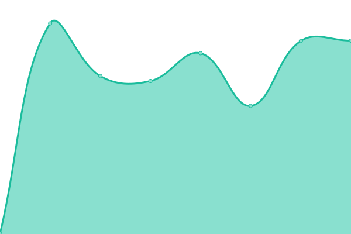
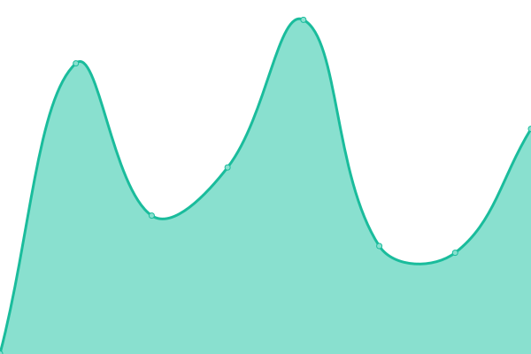
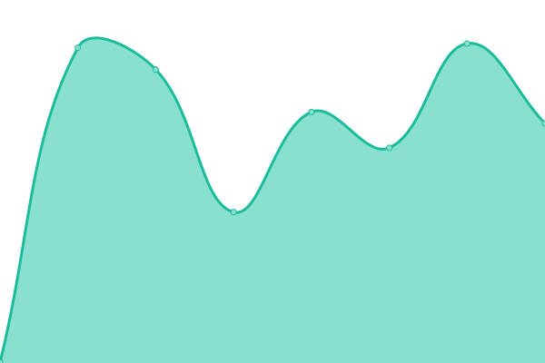
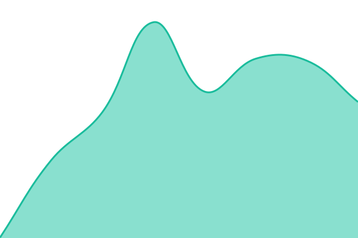
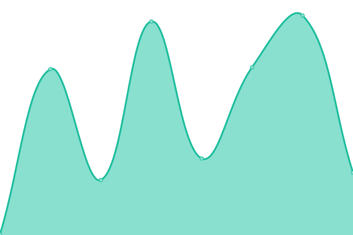
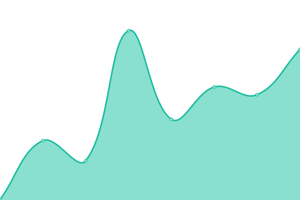
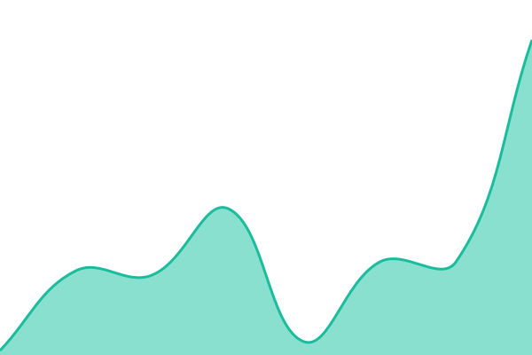

# [📈 Live Status](https://zoobean.github.io/status): <!--live status--> **🟩 All systems operational**

This repository contains the open-source uptime monitor and status page for [zoobean](https://zoobean.github.io/status), powered by [Upptime](https://github.com/upptime/upptime).

With [Upptime](https://upptime.js.org), you can get your own unlimited and free uptime monitor and status page, powered entirely by a GitHub repository. We use [Issues](https://github.com/zoobean/status/issues) as incident reports, [Actions](https://github.com/zoobean/status/actions) as uptime monitors, and [Pages](https://zoobean.github.io/status) for the status page.

<!--start: status pages-->
<!-- This summary is generated by Upptime (https://github.com/upptime/upptime) -->
<!-- Do not edit this manually, your changes will be overwritten -->
<!-- prettier-ignore -->
| URL | Status | History | Response Time | Uptime |
| --- | ------ | ------- | ------------- | ------ |
|  [Landing](https://www.beanstack.com/) | 🟩 Up | [landing.yml](https://github.com/zoobean/status/commits/HEAD/history/landing.yml) | 

 266ms
     
 | 

<a href="https://zoobean.github.io/status/history/landing">100.00%</a>
    

|  [App](https://zoobean.beanstack.org/reader365) | 🟩 Up | [app.yml](https://github.com/zoobean/status/commits/HEAD/history/app.yml) | 

 1200ms
     
 | 

<a href="https://zoobean.github.io/status/history/app">100.00%</a>
    

|  [Canada](https://canada.beanstack.com/reader365) | 🟩 Up | [canada.yml](https://github.com/zoobean/status/commits/HEAD/history/canada.yml) | 

 658ms
     
 | 

<a href="https://zoobean.github.io/status/history/canada">100.00%</a>
    

|  [DCPL](https://dclibrary.beanstack.com/reader365) | 🟩 Up | [dcpl.yml](https://github.com/zoobean/status/commits/HEAD/history/dcpl.yml) | 

 477ms
     
 | 

<a href="https://zoobean.github.io/status/history/dcpl">99.78%</a>
    

|  [LFPL](https://lfpl.beanstack.com/reader365) | 🟩 Up | [lfpl.yml](https://github.com/zoobean/status/commits/HEAD/history/lfpl.yml) | 

 412ms
     
 | 

<a href="https://zoobean.github.io/status/history/lfpl">99.78%</a>
    

|  [RMI](https://rmi.beanstack.com/up) | 🟩 Up | [rmi.yml](https://github.com/zoobean/status/commits/HEAD/history/rmi.yml) | 

 385ms
     
 | 

<a href="https://zoobean.github.io/status/history/rmi">100.00%</a>
    

|  Books | 🟩 Up | [books.yml](https://github.com/zoobean/status/commits/HEAD/history/books.yml) | 

 163ms
     
 | 

<a href="https://zoobean.github.io/status/history/books">100.00%</a>
    

|  Data | 🟩 Up | [data.yml](https://github.com/zoobean/status/commits/HEAD/history/data.yml) | 

 320ms
     
 | 

<a href="https://zoobean.github.io/status/history/data">100.00%</a>
    

|  Ops | 🟩 Up | [ops.yml](https://github.com/zoobean/status/commits/HEAD/history/ops.yml) | 

 27ms
     
 | 

<a href="https://zoobean.github.io/status/history/ops">100.00%</a>
    

<!--end: status pages-->

[**Visit our status website →**](https://zoobean.github.io/status)

## 📄 License

- Powered by: [Upptime](https://github.com/upptime/upptime)
- Code: [MIT](./LICENSE) © [zoobean](https://zoobean.github.io/status)
- Data in the `./history` directory: [Open Database License](https://opendatacommons.org/licenses/odbl/1-0/)
